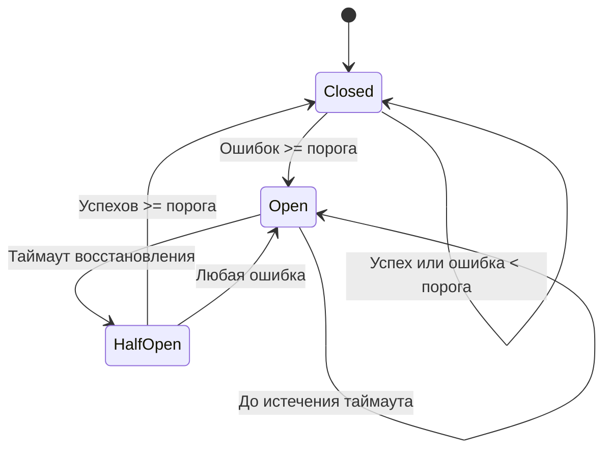
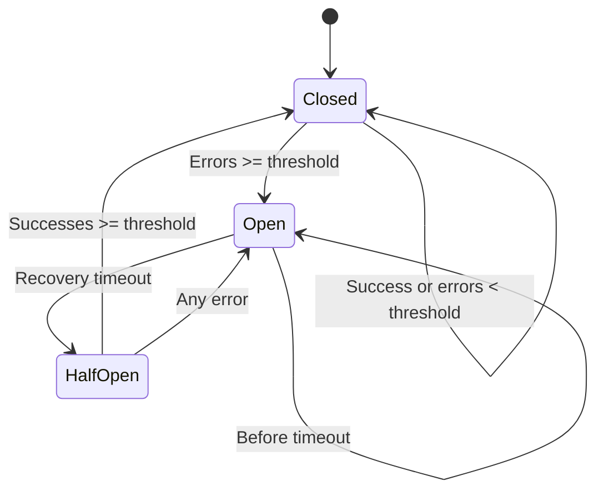

# Circuit Breaker

[🇷🇺 Русский](#русский) | [🇬🇧 English](#english)

---

## Русский

### Описание

**Circuit Breaker** — лёгкая и потокобезопасная реализация паттерна Circuit Breaker на Go. В текущей версии API ориентирован на менеджер circuit breakers, который позволяет управлять набором CB для разных сервисов/серверов.

### Ключевые возможности

- Защита от лавинообразных сбоев.
- Автоматическое восстановление после таймаута.
- Гибкая конфигурация порогов и процента пропуска в half-open.
- Потокобезопасность реализована через sync.RWMutex.
- Статистика и текстовое представление состояния для каждого CB.

### Диаграмма переходов состояний



### Быстрый старт

1. Создайте менеджер:
```go
// создаёт менеджер circuit breakers
mgr := circuitbreaker.NewCBManager()
```

2. Инициализируйте набор сервисов:
```go
cfg := circuitbreaker.CircuitBreakerConf{
    FailureThreshold: 5,
    RecoveryTimeout:  10 * time.Second,
    SuccessThreshold: 3,
    HalfOpenPrc:      20,
}
servers := []string{"service1", "service2"}
mgr.InitCircuitBreakers(servers, cfg)
```

3. Проверка возможности запроса и отчёт о результате:
```go
allowed, state := mgr.AllowRequest("service1")
if allowed {
    // Выполняем запрос...
    // при успехе:
    mgr.ReportSuccess("service1")
    // при ошибке:
    mgr.ReportFailure("service1")
} else {
    // Обработка заблокированного запроса (state содержит состояние)
}
```

4. Получение статистики и состояния:
```go
stats := mgr.GetCircuitBreakerStats()
stateStr := mgr.GetCircuitBreakerState("service1")
```

### Состояния

- **Closed** — все запросы разрешены.
- **Open** — все запросы блокируются.
- **Half-Open** — часть запросов разрешена для проверки восстановления.

---

## English

### Description

**Circuit Breaker** is a lightweight and thread-safe implementation of the Circuit Breaker pattern in Go. The current version's API is focused on a circuit breakers manager, which allows managing a set of CBs for different services/servers.

### Key Features

- Protection from cascading failures.
- Automatic recovery after a timeout.
- Flexible configuration of thresholds and allowed percentage in half-open.
- Thread safety implemented via sync.RWMutex.
- Statistics and textual state representation for each CB.

### State Transition Diagram



### Quick Start

1. Create a manager:
```go
// Creates a circuit breaker manager
mgr := circuitbreaker.NewCBManager()
```

2. Initialize a set of services:
```go
cfg := circuitbreaker.CircuitBreakerConf{
    FailureThreshold: 5,
    RecoveryTimeout:  10 * time.Second,
    SuccessThreshold: 3,
    HalfOpenPrc:      20,
}
servers := []string{"service1", "service2"}
mgr.InitCircuitBreakers(servers, cfg)
```

3. Request permission check and result reporting:
```go
allowed, state := mgr.AllowRequest("service1")
if allowed {
    // Execute the request...
    // on success:
    mgr.ReportSuccess("service1")
    // on error:
    mgr.ReportFailure("service1")
} else {
    // Handle blocked request (state contains the current state)
}
```

4. Retrieve statistics and state:
```go
stats := mgr.GetCircuitBreakerStats()
stateStr := mgr.GetCircuitBreakerState("service1")
```

### States

- **Closed** — all requests are allowed.
- **Open** — all requests are blocked.
- **Half-Open** — some requests are allowed to test recovery.
