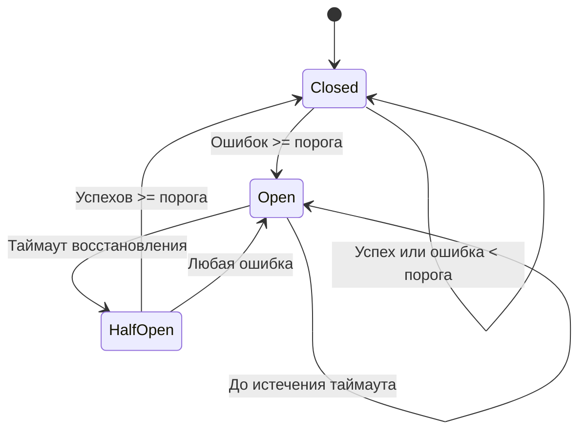
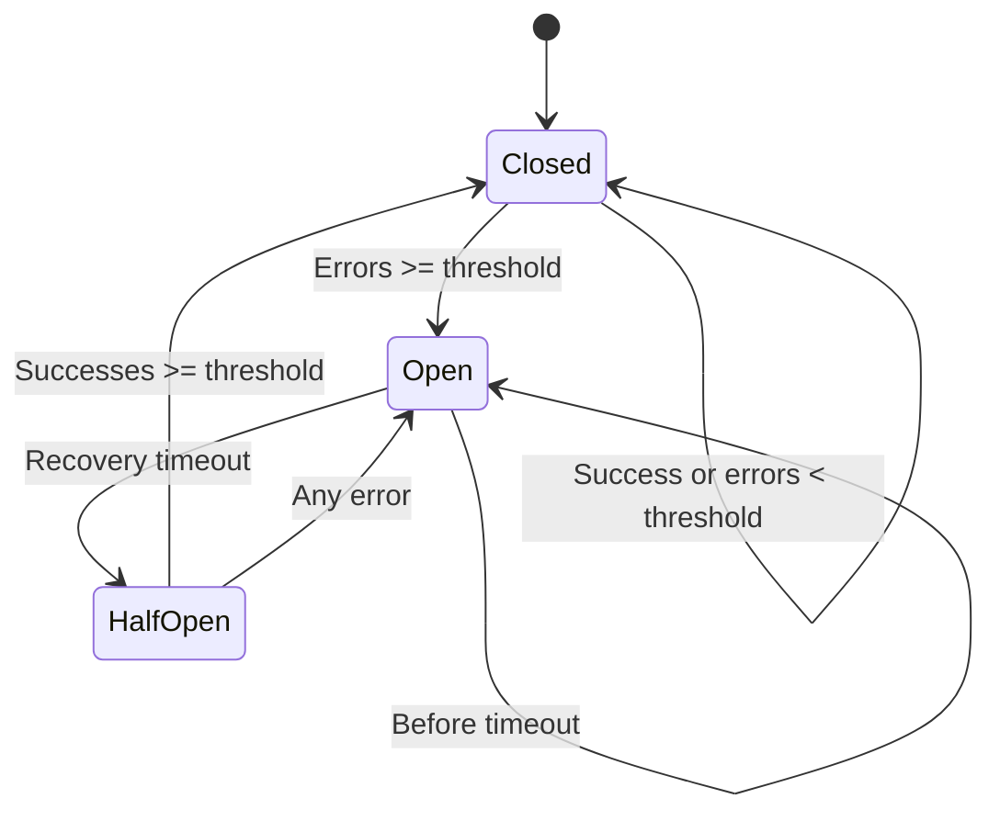

# Circuit Breaker

[🇷🇺 Русский](#русский) | [🇬🇧 English](#english)

---

## Русский

### Описание

**Circuit Breaker** — простая и эффективная реализация паттерна Circuit Breaker на Go. Этот паттерн помогает защищать сервисы от лавинообразных сбоев, ограничивая количество запросов к нестабильным или недоступным внешним системам.

### Преимущества использования

- **Защита от лавинообразных сбоев**: предотвращает перегрузку зависимых сервисов.
- **Автоматическое восстановление**: после таймаута Circuit Breaker пробует восстановить соединение.
- **Гибкая настройка**: можно задать пороги ошибок, таймауты и процент пропускаемых запросов в half-open состоянии.
- **Потокобезопасность**: реализовано с использованием sync.RWMutex.

### Диаграмма переходов состояний



### Быстрый старт

```go
import "github.com/yourname/circuitbreaker"

cb := circuitbreaker.New("my-service", circuitbreaker.CircuitBreakerConf{
    FailureThreshold: 5,
    RecoveryTimeout:  10 * time.Second,
    SuccessThreshold: 3,
    HalfOpenPrc:      20,
})

if cb.Allow() {
    // Выполнить запрос
    // ...
    cb.Success() // если успешно
    // cb.Failure() // если ошибка
}
```

### Состояния

- **Closed** — все запросы разрешены.
- **Open** — все запросы блокируются.
- **Half-Open** — часть запросов разрешена для проверки восстановления.

---

## English

### Description

**Circuit Breaker** is a simple and effective implementation of the Circuit Breaker pattern in Go. This pattern helps protect services from cascading failures by limiting requests to unstable or unavailable external systems.

### Advantages

- **Prevents cascading failures**: protects dependent services from overload.
- **Automatic recovery**: after a timeout, the circuit breaker tries to restore the connection.
- **Flexible configuration**: set error thresholds, timeouts, and allowed request percentage in half-open state.
- **Thread-safe**: implemented using sync.RWMutex.

### State Transition Diagram



### Quick Start

```go
import "github.com/yourname/circuitbreaker"

cb := circuitbreaker.New("my-service", circuitbreaker.CircuitBreakerConf{
    FailureThreshold: 5,
    RecoveryTimeout:  10 * time.Second,
    SuccessThreshold: 3,
    HalfOpenPrc:      20,
})

if cb.Allow() {
    // Perform request
    // ...
    cb.Success() // on success
    // cb.Failure() // on failure
}
```

### States

- **Closed** — all requests are allowed.
- **Open** — all requests are blocked.
- **Half-Open** — some requests are allowed to test recovery.
